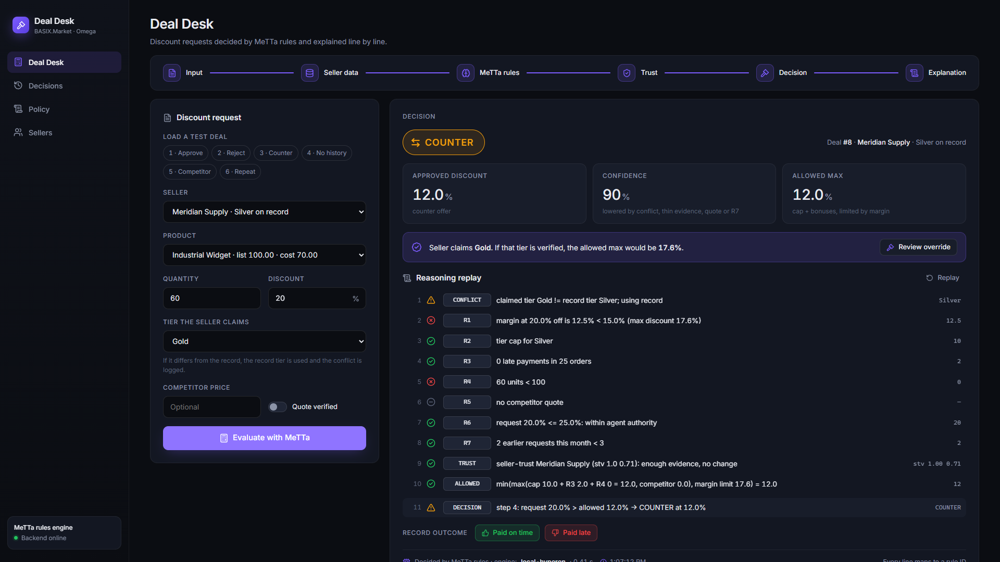
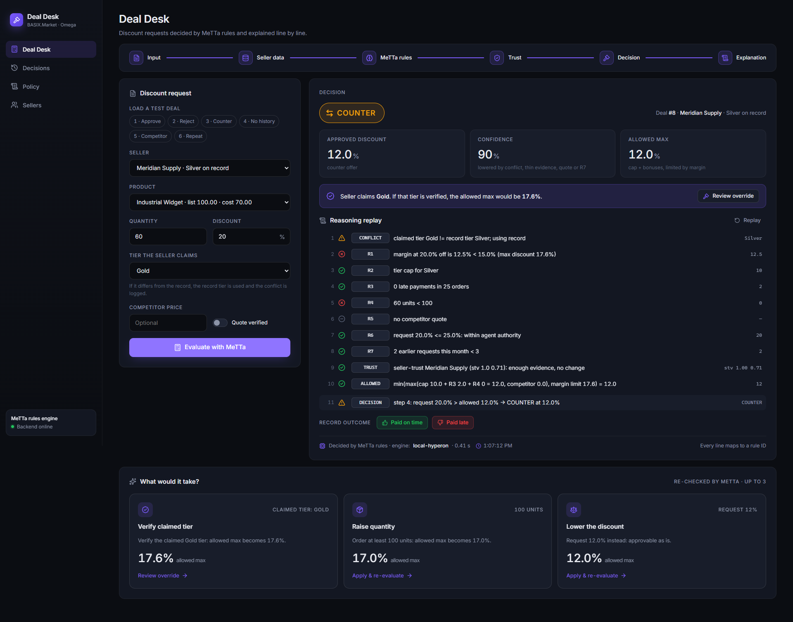
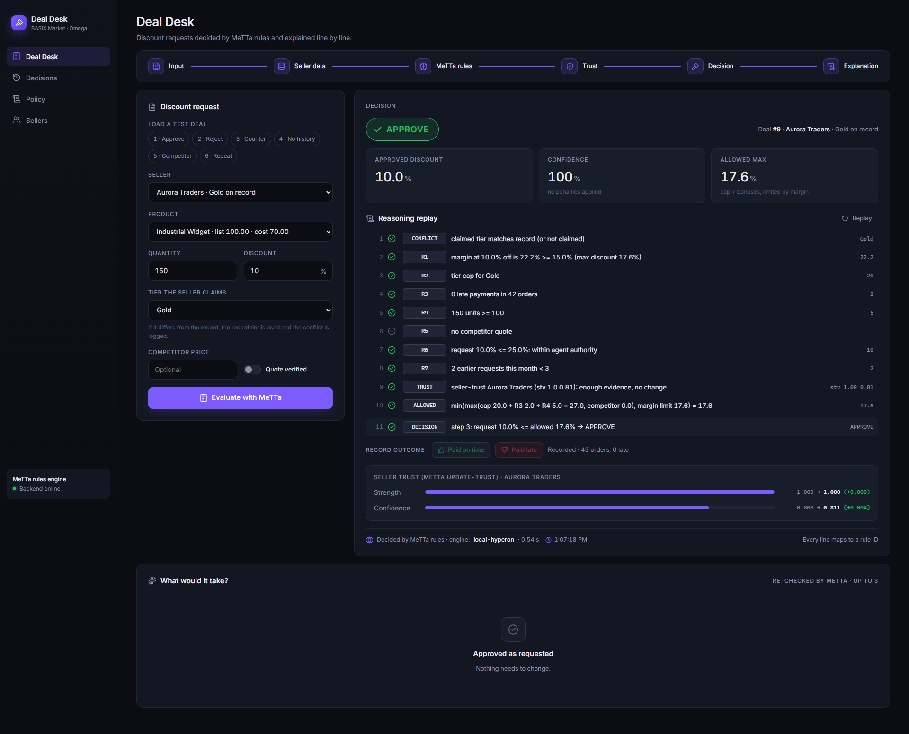
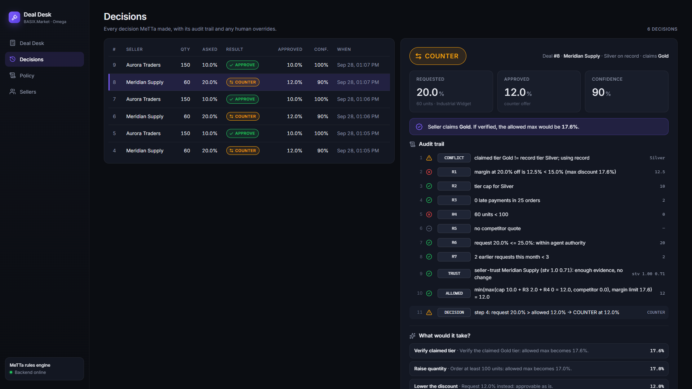
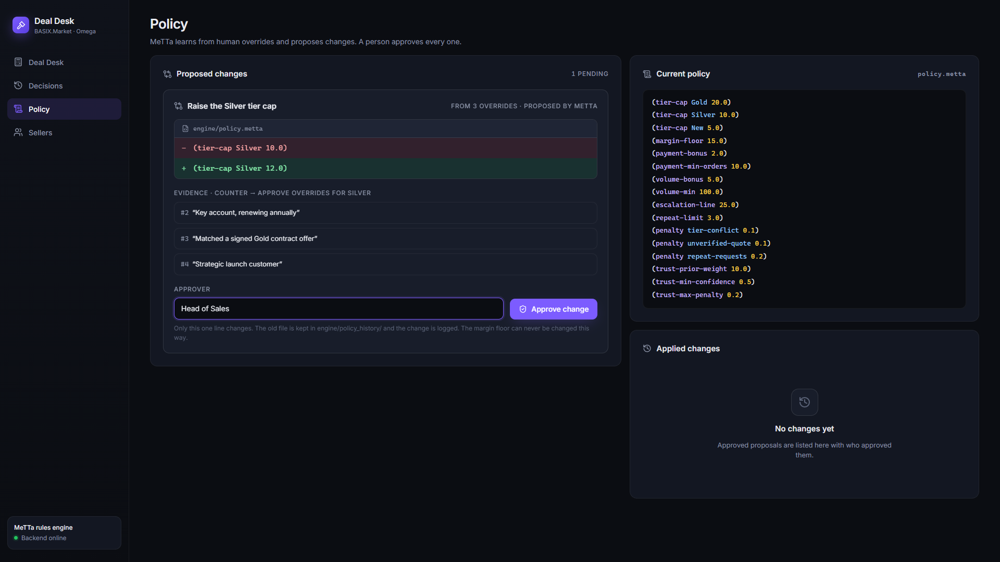
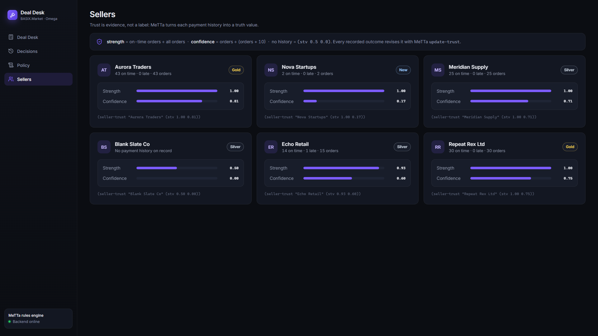
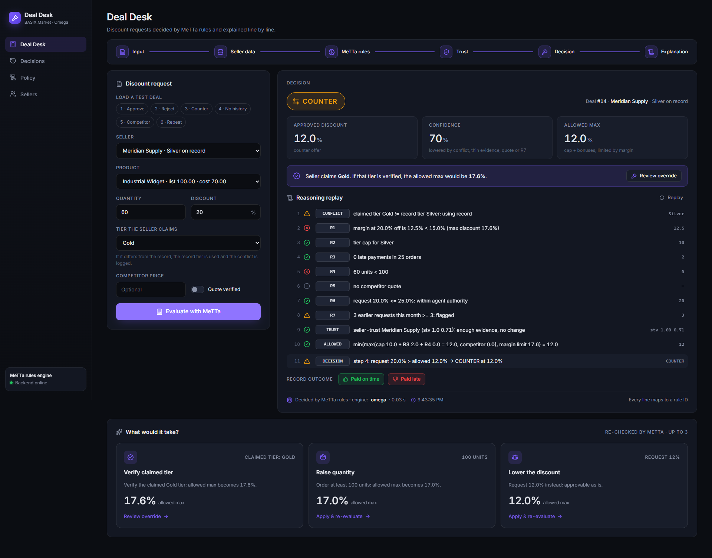

# TrustDeal

**The BASIX Deal Agent on Omega.** *Every discount, explained and proven.*

Discount requests decided by MeTTa rules and explained line by line, with a human in the loop
wherever it matters. That is the one feature: an **auditable decision**. It reaches people through
three outputs of the same decision: the web app, a **Telegram** chat (customers and seller alerts)
and a **quote PDF**.

Built for SingularityNET × Omega × BASIX, Omega Solo Track. (TrustDeal is the product name; code
modules, folders, tables and variables keep their `dealdesk` names.)

## Quick start

```bat
start.bat         (start with existing data)
start.bat reset   (start with fresh demo data)
stop.bat          (stop everything)
```

`start.bat` opens two windows, "TrustDeal - Backend" (http://localhost:8000) and
"TrustDeal - Frontend" (http://localhost:5173), waits until both respond, then opens the
app in your browser. It also prints whether the optional Telegram channel is on (see
[Telegram channel](#telegram-channel)). The frontend packages (`npm install`) are installed
automatically on the first start.

First time only, create the Python environment:

```bat
python -m venv .venv
.venv\Scripts\python -m pip install -r requirements.txt
```

## The problem

A seller on BASIX.Market asks for a discount: "Gold customer, 60 units, 20% off, please."
Today someone on the sales team has to check the margin, the seller's real tier, their
payment history, the volume, any competitor quote and how often they have asked this month.
Then they decide from memory and explain it badly, or not at all. Decisions are
inconsistent, slow and impossible to audit.

## What it does

The seller's request goes to a rule engine written in MeTTa. It answers **APPROVE**,
**REJECT**, **COUNTER** (with the best discount it can offer) or **ESCALATE** (to a human),
with:

- a **confidence** score,
- an **audit trail**: every rule it checked, the value, and pass / fail / warning / skipped,
  each line tied to a rule ID (R1-R7, CONFLICT, TRUST, ALLOWED, DECISION),
- an **override hint** when the seller claims a different tier than the record shows.

A human can override any decision. The override is recorded next to the original decision,
which is never changed.

See [samples/audit_trail.md](samples/audit_trail.md) for a full example.

## What makes it different

**D1 - "What would it take?"** For every COUNTER, REJECT or ESCALATE, MeTTa re-runs its own
rules with one input changed (verify the claimed tier, verify the competitor quote, raise the
quantity, lower the discount) and offers up to 3 changes that really do get approved. Every
option is re-checked by the same rules. Nothing that breaks the margin floor is ever suggested.

**D2 - Learning from overrides, with human approval.** When humans keep overriding the same
kind of decision (3+ COUNTER -> APPROVE for one tier), MeTTa proposes a policy change, e.g.
`(tier-cap Silver 10.0)` -> `(tier-cap Silver 12.0)`, with the override IDs and reasons as
evidence. Nothing changes until a named person approves it. Then exactly one line of
`policy.metta` is rewritten, the old file is archived and the change is logged. The margin
floor can never be changed this way.

**D3 - Evidence-based seller trust.** Each seller's reliability is a truth value,
`(seller-trust "Aurora Traders" (stv 1.0 0.8))`: strength = on-time / all orders,
confidence = orders / (orders + 10). A seller with no history is `(stv 0.5 0.0)`, which means
"we don't know". Thin evidence lowers the decision's confidence. Every recorded payment outcome
revises the truth value (PLN-style revision), so trust grows or shrinks with evidence.

## How it works

```
 Browser (React)                 FastAPI backend (Python)                 MeTTa engine
 ───────────────                 ────────────────────────                 ────────────
 request form   ──POST /deals──►  gather data from SQLite
                                  (tier, prices, history,
                                   requests this month)
                                  build (deal ...) expression ──────────► policy.metta   facts
                                                                          rules.metta    R1-R7, conflict,
                                                                                         trust, decision,
                                                                                         what-if
                                                                          learning.metta D2 proposals
                                  parse (decision ...) result ◄────────── (decision RESULT DISCOUNT
                                  store decision + trail                     CONFIDENCE TRAIL HINT ...)
 decision card  ◄──JSON─────────  fixed-template explanation
```

- **MeTTa decides.** Every number and every rule lives in the `.metta` files.
- **Python only translates.** It builds the input expression and parses the output. It
  contains no business rules.
- **The LLM never decides.** The explanation text is produced by fixed templates from the
  MeTTa trail. An LLM-based free-text parser is planned, and it would only fill in form fields.

Decision order (from [CLAUDE.md](CLAUDE.md)):
`allowed max = min(tier cap + earned bonuses, largest discount that keeps a 15% margin)`,
then 1. price below cost -> REJECT, 2. request > 25% -> ESCALATE, 3. request <= allowed max
-> APPROVE, 4. otherwise -> COUNTER at the allowed max.

## Omega integration

**Status: decisions run inside Omega's MeTTa engine (PeTTa), verified in harness mode.
The full OmegaClaw agent run (ASI:One LLM, IRC chat) is the last step - see TODO.**

```
Backend (Windows)                        Omega container (OmegaClaw agent process, PeTTa)
OmegaRunner.run("(evaluate-core ...)")
  |-- WebSocket /omega/engine  <-------- TrustDeal plugin `dealdesk` (connects out, bearer token)
  |     {id, expr}  ------------------->   evaluates the EXACT expression in the agent's space,
  |     {id, result text, ms}  <-------    where policy/rules/learning.metta are loaded at startup
  |-- parse -> same dict as LocalMettaRunner          no LLM anywhere in the decision path
```

- **Deterministic:** every decision is executed exactly in the agent's PeTTa runtime. It is
  not a chat message to the agent's LLM, so nothing can be interpreted or rephrased.
- **Same rules:** the plugin loads the same `engine/` files, mounted read-only. It sends their
  SHA-256 hash, and the backend refuses to run if the hash differs from its own files.
- **Portability:** one set of `.metta` files runs on both hyperon and PeTTa.
  - `engine/compat_petta.pl` adds `format-args`, which PeTTa lacks. It is loaded on PeTTa only.
  - A computed `(zero-float)` makes zeros print identically on both engines.
  - The helper `take` was renamed `take-first`, because OmegaClaw has its own `take`.
- **No silent fallback:** with `ENGINE_RUNNER=omega`, a missing agent, different rules or a
  timeout (10 s) give a clear HTTP 503, and an evaluation error inside Omega gives a 502.
- **Hot reload:** after a D2 policy change is approved, the backend tells the plugin to reload.
  The plugin swaps the changed `policy.metta` facts in the agent's space, e.g.
  `(tier-cap Silver 10.0)` -> `(tier-cap Silver 12.0)`, and the backend checks the rules hash
  again. No restart is needed. If the reload fails, the approval returns a clear 503, and
  decisions are refused until Omega runs the same rules. Changes to `rules.metta` still
  need an Omega restart.
- The UI footer shows `engine: omega`, and `GET /omega/status` shows the connection and rules
  hash.
- PeTTa (SWI-Prolog) prints some floats in exponent form, also inside trail text
  (20000.0 -> `2.0e+04`). `OmegaRunner` rewrites them as plain decimals, exactly as the local
  engine prints them, so no page shows exponent form; prices are shown as rupees (₹20,000).

**Verified against the full OmegaClaw agent** (2026-09-30, `start-omega.bat agent`, ASI:One
model `asi1`): 6 test deals and 5 category deals (`evaluate-core` + `what-if-for`), 5 category
profiles and 10 trust and policy-learning calls = 37 queries, 3 runs in a row = **111/111
identical** to local hyperon, as exact text and as parsed values. (Harness mode earlier: 66/66.)
After the security hardening the same 111/111 were re-verified in harness mode
([samples/omega_parity_report.md](samples/omega_parity_report.md)), now including the request
check and the live-rule fingerprint check on every call.

| Through the Omega agent (HTTP API, deals 1/3/5, 3 rounds) | Evaluate | What-if |
|---|---|---|
| Measured | 32-86 ms, median 50 ms (340 ms first call) | 17-48 ms, median 21 ms |
| Engine round trip inside that (parity test) | 2.5-6.7 ms per query | |
| Round trip with the live-rule check (harness, after hardening) | 6.8-10.2 ms per query, median 7.6 ms | |

Agent-mode notes: OmegaClaw sandboxes the agent with Landlock (reads only under `/PeTTa`, …)
and scrubs its environment, so the plugin and rules are mounted under `/PeTTa/dealdesk/`. The
plugin reads its token once from `omega/runtime_secret/token` (generated from `omega.env` on each
start, git-ignored, mounted at `/tmp/dealdesk-secret`) and deletes it before the agent loop starts;
`omega.env` itself is never mounted. Before every decision the plugin also checks a fingerprint of
the rules actually loaded in Omega's memory (503 if they changed). See [SECURITY.md](SECURITY.md).

**How to run**

```bat
omega\start-omega.bat          (harness: PeTTa + TrustDeal plugin, no LLM, no API key)
omega\start-omega.bat agent    (full OmegaClaw agent: IRC ##DealDeskNithish2026, ASI:One model asi1)
start.bat omega                (app with ENGINE_RUNNER=omega; waits for Omega to connect)
omega\stop-omega.bat
```

Secrets live in `omega/omega.env`, which is git-ignored. `start-omega.bat` creates it on
first run and generates `DEALDESK_TOKEN` and `OMEGACLAW_AUTH_SECRET`. You type
`ASIONE_API_KEY` yourself.

Parity test against a running Omega (port 8000 must be free):
`set OMEGA_PARITY=1 && .venv\Scripts\python -m pytest tests/test_omega_parity.py -s`

**TODO (final step):**
- [x] Put the ASI:One key in `omega/omega.env`, run `omega\start-omega.bat agent`, and repeat the
      3x parity test and the latency measurement against the full agent.
- [ ] Stretch goal: in IRC chat the agent answers "why was deal X decided this way?" from the
      stored audit trail (read-only).

## The 6 test deals

| # | Case | Seller (record tier) | Request | Result |
|---|------|---------------------|---------|--------|
| 1 | Approve | Aurora Traders (Gold) | 150 units, 10% | APPROVE 10%, confidence 100% |
| 2 | Reject | Nova Startups (New) | 10 units, 35% | REJECT: price 65 is below cost 70 |
| 3 | Counter + tier conflict | Meridian Supply (Silver, claims Gold) | 60 units, 20% | COUNTER 12%, override hint "Gold -> 17.6%" |
| 4 | Missing payment history | Blank Slate Co (Silver) | 30 units, 8% | APPROVE 8%, confidence 80% (trust 0.0) |
| 5 | Unverified competitor quote | Echo Retail (Silver) | 40 units, 15%, quote 84 | COUNTER 10%, quote ignored and logged |
| 6 | Repeat requests | Repeat Rex Ltd (Gold) | 50 units, 10% | APPROVE 10%, R7 warning (4th request this month) |

## Screenshots

| | |
|---|---|
|  |  |
|  |  |
|  |  |
|  | |

## Autonomous agent (Customer page)

Open **http://localhost:5173/#customer** (or the Customer | Seller switch). A shopper picks a
product and asks in their own words, e.g. *"Can I get 20% off this phone?"*. An agent handles
the request until it is closed, protecting the store's margin while closing the deal.

```
customer message / button / manager's answer
 └ perceive  ASI:One (asi1, function calling) -> {product, quantity, discount_asked, claimed_tier, intent}
             and which information tools to use; every value is checked against the customer's text
 └ decide    MeTTa: the discount decision (rules.metta) + (next-action STATE DECISION EVENT) (agent.metta)
 └ act       Python only executes that action: create-quote, send-counter, send-decline,
             create-escalation-task, request-verification, place-order, wait, close
 └ follow up MeTTa is asked again ("tick") until it waits or closes the deal
```

- **States:** NEW, WAITING_CUSTOMER, WAITING_VERIFICATION, ESCALATED, QUOTED, DECLINED, ORDERED, CLOSED.
  Agent rules A1-A12 in [engine/agent.metta](engine/agent.metta); every step is written to the
  activity log with its rule ID and a link to the decision's audit trail.
- **Every number comes from MeTTa:** offers (never above the allowed max), prices, totals, savings
  and the 48 h quote validity (`quote-terms`), and catalog alternatives (`alternatives`). Up to 3
  negotiation rounds; a 4th ask is declined (A8). A manager's approval of an escalation gives the
  requested discount, but MeTTa still refuses anything below the margin floor or above the
  category max.
- **Customers reuse the seller rules:** loyalty tier = record tier (R2 caps), order history =
  payment history (R3, trust), their requests this month = R7. Negotiation rounds are not new requests.
- **Tools:** `evaluate_deal` (MeTTa), `suggest_alternatives` (cheaper model or bigger quantity from the
  store's own catalog, each APPROVED by MeTTa), `market_price_lookup` (Tavily web search, with source
  URLs, cached 24 h, seller-only, never auto-verified; "tool unavailable" without `TAVILY_API_KEY`),
  `create_quote`, `create_task`, `send_message`, `place_order`. ASI:One chooses the information tools;
  the action tools run only when MeTTa's next action says so.
- **Language guardrails:** replies are drafted by ASI:One from customer-safe facts only; every number
  must equal a MeTTa or catalog number and the text may not mention costs, margins or rules,
  otherwise a fixed template is used. No key, an outage or a rate limit -> templates and a rule-based
  parser, logged as "language model unavailable". The agent keeps working.
- **Customer-safe:** the `/customer/*` API is built from allowlists. A customer never sees cost,
  margin, rule IDs, confidence, trust, the audit trail, market evidence, tool logs or other customers.
- **Seller side:** the **Agent inbox** shows every conversation with its MeTTa audit trails, the
  activity timeline, human tasks (approve an escalation, verify a claimed tier) and the autonomy
  switch (**auto-send** or **draft for approval**).

### One decision, three outputs

```
                                                             ┌─ Web: Customer page chat, Agent inbox (seller)
 customer ask ─► agent loop ─► MeTTa decision + audit trail ─┼─ Telegram: customer chat, seller alerts
                                                             └─ Quote PDF: download, or a document on Telegram
```

Telegram and the PDF are not separate features: they are channels and outputs of the same
auditable decision. Telegram messages go through the **same agent loop** as web chat (same code,
same limits, same MeTTa decisions, same audit trail), and every number in a Telegram reply or a
PDF is a MeTTa or catalog number.

### Telegram channel

Optional. Without a token the channel is off (one log line), and everything else works as before.

**Setup with BotFather (once):**
1. In Telegram, open **@BotFather** and send `/newbot`. Choose a display name (for example
   "TrustDeal BASIX Store") and a username that ends in `bot`.
2. BotFather replies with a token such as `123456789:AA...`. Put it in `omega/omega.env`
   (git-ignored; `omega\start-omega.bat` creates the file, or copy `omega/omega.env.example`):
   `TELEGRAM_BOT_TOKEN=123456789:AA...` (no quotes, no spaces).
3. Recommended: in BotFather, `/setjoingroups` -> Disable. The bot serves private chats only.
4. Run `stop.bat`, then `start.bat`. The launcher prints `Telegram: on`.

The bot uses **long polling** (`getUpdates`) from inside the backend process: no public URL, no
webhook, nothing to deploy. `start.bat` / `stop.bat` start and stop it with the backend. In Omega
mode its decisions go through the same Omega runner.

**Customers:** on the Customer page click **Connect Telegram**, then **Open @yourbot in Telegram**
(or send `/start CODE` to the bot). The code works once, for 10 minutes. Then ask in plain words,
e.g. *"Can I get 20% off Smartphone A 128GB?"*. Offers come with **Accept / Ask again / No thanks**
buttons (plus "Switch to option N" for alternatives). Accept gives a quote, sent with its **PDF**
and a **Place order** button. `/stop` disconnects the chat. Replies are customer-safe: they are
built from the same allowlisted views as the Customer page, so there is no cost, margin, rule or
confidence. In "draft for approval" mode a reply reaches Telegram only after a seller approves it.

**Seller alerts:** in the **Agent inbox** click **Connect Telegram** and link your own chat the same
way. Every new escalation or tier verification task arrives with **Approve / Reject** buttons. They
resolve the task through the same endpoint as the inbox buttons (reviewer "Seller via Telegram"),
and the customer is updated on their channel.

**Audit:** in the Agent inbox, Telegram requests and messages carry a **Telegram** tag
(`channel = telegram`). The activity timeline shows `telegram_in`, `telegram_out`,
`telegram_alert` and `telegram_link` entries next to the MeTTa decisions.

**Limits:** the same as web chat (500 characters, 20 messages per customer per 10 minutes, shared
across both channels). Only linked private chats are served. An unknown chat gets one short
"please connect from the store page" reply, and link attempts are throttled.
See [SECURITY.md](SECURITY.md#telegram-channel).

### Quote PDF

Every quote can be downloaded as a one-page PDF (**Download PDF** on the quote card). On Telegram
it is sent as a document together with the quote. It shows the store name (TrustDeal · BASIX
Store), customer, product, quantity, list price, discount, price each, total, savings, quote ID,
validity and issue date, plus the order reference once the order is placed. Every amount is a
catalog price or a number MeTTa returned (`quote-terms`). There is no cost or margin. The rupee sign
uses the bundled Noto Sans font (SIL Open Font License, [backend/assets/fonts/OFL.txt](backend/assets/fonts/OFL.txt)).

**Demo flow:** as Priya (Gold) ask 20% off *Smartphone A* -> "best price" 12% (mobiles category max)
plus the cheaper *Smartphone Lite* as an alternative -> ask again 15% -> still 12% -> Accept ->
quote Q-00001 -> Place order. Then ask 30% off *Wireless Earbuds* -> "A manager is reviewing your
request" -> in the Agent inbox click Approve -> the customer's chat updates with the 30% quote.
As Arjun (Silver), "I'm a Gold member, can I get 15% off 60 units?" on the *Industrial Widget* ->
verification task -> Verified -> 15% quote.
A real recorded run with the seller-side trail: [samples/agent_transcript.md](samples/agent_transcript.md).

**Telegram demo:** connect Priya on the Customer page and the seller in the Agent inbox. In Telegram,
ask 20% off *Smartphone A 128GB* -> 12% offer with buttons -> Accept -> quote + PDF -> Place order.
Connect Neha and ask 30% off *Wireless Earbuds* -> the seller chat gets an alert -> Approve ->
Neha's chat receives the 30% quote and its PDF. Each step appears in the Agent inbox, tagged Telegram.

## Running tests

```bat
.venv\Scripts\python -m pytest tests
```

276 tests, plus 2 optional Omega parity tests (the rules and the agent's rules on PeTTa).
`tests/test_agent.py` and `tests/test_agent_tools.py` cover the agent end to end with ASI:One and
the web search mocked (full loops, escalation, verification, alternatives, guardrails,
fallbacks, customer-safe responses). The others cover the engine rules and the 6 test
deals, the API, D1-D3, the policy and outcome routes, the UI endpoints, CSV import, and
OmegaRunner with a fake plugin (not connected, wrong token, different rules, timeout, Omega
error, hot reload after a policy change, failed reload, changed live rules).
`tests/test_telegram.py` drives the Telegram channel with a mocked Bot API: linking with one-time
codes, the full negotiation loop, a seller approving by button, unlinked and group chats, other
customers' buttons, drafts, limits, a missing token, and the token never reaching a log line.
`tests/test_quote_pdf.py` reads the generated PDF and checks every field and the absence of costs,
margins and rule names.
`tests/test_security.py` covers MeTTa injection attempts, invalid inputs, CSV limits, CORS,
hosts, security headers, the WebSocket and the plugin's own checks, and log redaction (see
[SECURITY.md](SECURITY.md)). The API tests use a temporary database and a temporary
copy of `engine/`, so the real data and policy are never changed by tests.

## Performance

A refactor of `rules.metta` computed shared values once and replaced slow `let*` bindings.
The business logic did not change: all 63 deals in a before/after snapshot gave identical
output, and all tests pass.

| (local hyperon, per request) | Before | After |
|---|---|---|
| Evaluate a deal | ~1.5 s | **~0.25 s** |
| What-if options | ~2.5 s | **~0.4 s** |

What-if options load on demand, after the decision is shown. Through Omega (PeTTa) the same
calls are faster still - see [Omega integration](#omega-integration).

## Project layout

```
engine/    policy.metta (facts), rules.metta (logic), learning.metta (D2), agent.metta (agent:
           next action, quote terms, alternatives), compat_petta.pl (PeTTa format-args),
           bridge.py (Python <-> MeTTa/Omega), metta_safe.py (safe MeTTa text),
           omega_link.py (backend <-> Omega plugin), policy_admin.py (applies approved proposals)
omega/     TrustDeal plugin (dealdesk) for OmegaClaw, plugins.yaml, start/stop scripts, omega.env.example
backend/   FastAPI app, SQLite models, routes, services; backend/agent/ (the agent loop,
           language layer with guardrails, tools, customer-safe views); backend/telegram/
           (Bot API client, long polling, linking, the bot); services/quote_pdf.py and
           assets/fonts/ (Noto Sans, OFL) for the quote PDF
frontend/  React + Vite UI (Customer page; seller: Deal check, Decisions, Agent inbox, Policy,
           Sellers, Products)
data/      seed data (python -m data.seed): sellers, products, customers, the 6 test deals
samples/   audit_trail.md, agent_transcript.md, omega_parity_report.md, screenshots
tests/     pytest suite
```

## What existed before the hackathon

Nothing. The project was built from scratch during the hackathon.

## AI disclosure

Every AI tool and service involved, and what it is never used for:

| Tool / service | Used for | Never used for |
|---|---|---|
| **Claude Code** (Anthropic) | Building TrustDeal: scaffolding, help implementing the MeTTa rules, debugging, tests, the UI and documentation (incl. the Telegram channel and the quote PDF) | Not part of the running app |
| **ASI:One `asi1`**, customer agent | Understanding customer messages (web chat and Telegram) into fields, choosing information tools, drafting replies | Deciding, or any number: every number in a draft must equal a MeTTa or catalog number, otherwise the fixed template is sent |
| **ASI:One `asi1`**, inside Omega (agent mode) | The OmegaClaw agent's own chat loop | TrustDeal decisions: the plugin evaluates MeTTa directly, never through its LLM loop |
| **Tavily** (only if `TAVILY_API_KEY` is set) | Seller-only market price lookup, with source URLs | Decisions; results are never auto-verified and never shown to customers |

**I** designed the business rules, the decision order and the differentiators, and I reviewed
the logic. Decisions come only from the MeTTa rules (in Omega in omega mode).

**Integrations (not AI):** Telegram Bot API (customer chat channel and seller alerts, long
polling), OmegaClaw / PeTTa (the decision runtime), reportlab and Noto Sans (quote PDF).

## What I'd build next

- **PLN reasoning over the trust truth values**, instead of fixed thresholds.
- **More override directions for D2**, e.g. APPROVE -> REJECT, which would tighten a cap.
- **Free-text requests on the Seller Deal check page** too (the customer agent already parses them).
- **Real logins** for customers and store staff, and quote expiry handling.
- **Real marketplace integration** with BASIX.Market sellers, products and orders.
